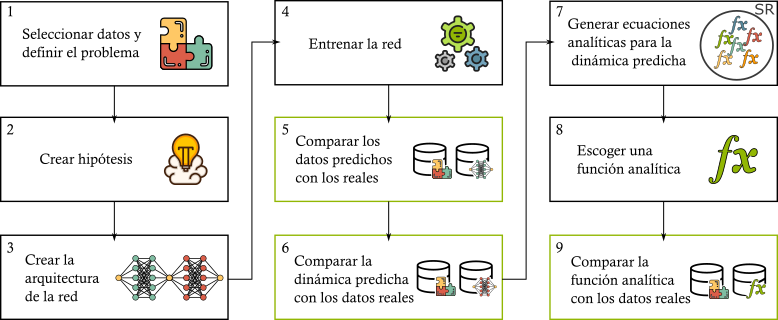

# **Modelado del Crecimiento Bacteriano Bajo Antibóticos usando PINNs y Regresión Simbólica / Modeling Bacterial Growth Under Antibiotics using PINNs and Symbolic Regression**

### 🎓 **Proyecto TFM / Master Thesis Project**
**ES:** Este trabajo forma parte del **Trabajo Final de Máster (TFM)** del **Máster en Inteligencia Artificial de la UNIR**, realizado bajo la supervisión de:  
- **Prof. Jordi García Ojalvo**, Universitat Pompeu Fabra (UPF)  
- **Dr. Wilmer Efrén Pereira González**, Universidad Internacional de La Rioja (UNIR)  

**EN:** This work is part of the **Master Thesis (TFM)** for the **Master's in Artificial Intelligence at UNIR**, carried out under the supervision of:  
- **Prof. Jordi García Ojalvo**, Universitat Pompeu Fabra (UPF)  
- **Dr. Wilmer Efrén Pereira González**, Universidad Internacional de La Rioja (UNIR)  

---

### 🌟 **Descripción del Proyecto / Project Description**
**ES:** El crecimiento bacteriano es un proceso dinámico afectado por múltiples factores, como la concentración de antibóticos. Este proyecto tiene como objetivo encontrar una representación analítica interpretable del crecimiento de bacterias mediante una combinación de técnicas avanzadas de PINNs y regresión simbólica.

- **PINNs (Physics-Informed Neural Networks):** Se entrenan dos redes neuronales acopladas, donde una predice la densidad de bacterias a cada instante y la otra su derivada temporal.  
- **Regresión simbólica:** Proceso para descubrir expresiones matemáticas que describen la evolución temporal del sistema, generando modelos comprensibles.

**EN:** Bacterial growth is a dynamic process influenced by multiple factors, such as antibiotic concentration. This project aims to find an interpretable analytical representation of bacterial growth using a combination of advanced PINNs and symbolic regression techniques.

- **PINNs (Physics-Informed Neural Networks):** Two coupled neural networks are trained, one predicting the bacterial density at each moment and the other its time derivative.  
- **Symbolic regression:** A process to discover mathematical expressions describing the system's temporal evolution, generating interpretable models.

<div style="background-color: white; padding: 10px;">
    
</div>

<!--    -->
*ES: Figura 1: Representación del flujo del sistema, desde la recopilación de datos hasta la obtención de fórmulas analíticas.*  
*EN: Figure 1: System flow representation, from data collection to obtaining analytical formulas.*

---

### 📁 **Estructura del Repositorio / Repository Structure**
```
📾 Bacterial_Growth  
 ├ 📂 DataExperiments        # Datos experimentales / Experimental data  
 ├ 📂 Img                    # Imágenes generadas por el código / Images generated by the code  
 ├ 📂 Utilities              # Scripts para el estilizado / Utility scripts for styling  
 ├ 📂 X                      # Grupos de experimentos / Experiment groups changing the network structure  
 ├ 📄 requirements.txt       # Dependencias / Dependencies  
 ├ 📄 README.md              # Este archivo / This file  
```

---

### 🧬 **Datos / Data**
**ES:** El dataset principal contiene medidas de densidad bacteriana obtenidas bajo distintas concentraciones de antibóticos. Las variables principales incluyen:  
- **Tiempo:** Evolución temporal del sistema.  
- **Concentración del antibótico:** Factor que afecta al crecimiento.  
- **Densidad de bacterias a cada instante de tiempo:** Variable dependiente que mide la cantidad de bacterias.

**EN:** The main dataset contains bacterial density measurements taken under different antibiotic concentrations. The key variables include:  
- **Time:** Temporal evolution of the system.  
- **Antibiotic concentration:** Factor affecting growth.  
- **Bacterial density at each time:** Dependent variable measuring the number of bacteria.

Los datos se encuentran en la carpeta / The data can be found in the folder `DataExperiments/`.

---

### 📊 **Ejemplo de Resultados / Results Example**

**ES:** A continuación, mostramos un ejemplo de las predicciones obtenidas y la comparación con los datos experimentales:  
**EN:** Below, we present an example of the predictions obtained and their comparison with experimental data:

  
**Aprendizaje de la dinámica del sistema con datos sintéticos / Learning system dynamics with synthetic data**  

- **A)** Arquitectura empleada durante el aprendizaje, con dos redes neuronales acopladas: $NN_u$ y $NN_\phi$.  
  *A) Architecture used during training, with two coupled neural networks: $NN_u$ and $NN_\phi$.*  
- **B)** Evolución de la función de pérdida a lo largo de las epochs.  
  *B) Loss function evolution over epochs.*  
- **C)** Descomposición de los términos de la función de pérdida a lo largo de las epochs.  
  *C) Decomposition of loss function terms over epochs.*  
- **D)** Salida de la red $NN_u$ tras el aprendizaje, mostrando la población estimada $\hat{P}$, la población real $P^*$ y los conjuntos de entrenamiento $u$ y $f$.  
  *D) Output of network $NN_u$ after training, showing the estimated population $\hat{P}$, real population $P^*$, and training sets $u$ and $f$.*  
- **E)** Valores de los parámetros Score, Loss y Complexity obtenidos por el modelo de regresión simbólica aplicado a la función estimada por $NN_\phi$.  
  *E) Values of Score, Loss, and Complexity parameters obtained by symbolic regression applied to the function estimated by $NN_\phi$.*  
- **F)** Comparación de las aproximaciones obtenidas con las curvas generadas a partir del subconjunto $u$ y la función real $P^*$.  
  *F) Comparison of approximations obtained with curves generated from subset $u$ and the real function $P^*$.*  
- **G)** Resultado final de la red $NN_\phi$ tras el aprendizaje y el ajuste del modelo simbólico.  
  *G) Final result of network $NN_\phi$ after training and symbolic model adjustment.*

---

### 📞 **Contacto / Contact**
**ES:** Si tienes dudas, sugerencias o quieres colaborar en el proyecto, no dudes en contactarme:  
**EN:** If you have any questions, suggestions, or would like to collaborate on the project, feel free to contact me:

- **Nombre / Name:** Júlia Vicens Figueres  
- **Institución / Institution:** Universitat Pompeu Fabra (UPF)  
- **Correo / Email:** julia.vicens@upf.edu  

---