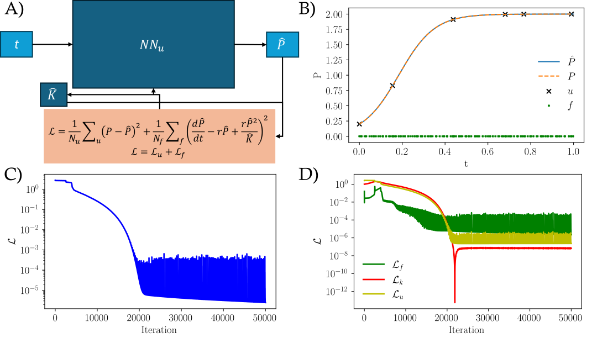

# **Modelado del Crecimiento Bacteriano Bajo Antibóticos usando PINNs y Regresión Simbólica**

Este repositorio contiene el código para modelar y predecir la dinámica del crecimiento de *E. coli* en presencia de antibóticos. Utilizamos Redes Neuronales Informadas por Física (PINNs) acopladas con regresión simbólica para encontrar expresiones analíticas que describen el comportamiento observado experimentalmente.

---

## 🎓 **Proyecto TFM**  
Este trabajo forma parte del **Trabajo Final de Máster (TFM)** del **Máster en Inteligencia Artificial de la UNIR**, realizado bajo la supervisión de:  
- **Prof. Jordi García Ojalvo**, Universitat Pompeu Fabra (UPF)  
- **Dr. Wilmer Efrén Pereira González**, Universidad Internacional de La Rioja (UNIR)  

---

## ✨ **Descripción del Proyecto**  
El crecimiento bacteriano es un proceso dinámico afectado por múltiples factores, como la concentración de antibóticos. Este proyecto tiene como objetivo encontrar una representación analítica interpretable del crecimiento de bacterias mediante una combinación de técnicas avanzadas de PINNs y regresión simbólica.

- **PINNs (Physics-Informed Neural Networks):** Se entrenan dos redes neuronales acopladas, donde una predice la densidad de bacterias a cada instante y la otra su derivada temporal.  
- **Regresión simbólica:** Proceso para descubrir expresiones matemáticas que describen la evolución temporal del sistema, generando modelos comprensibles.

  
*Figura 1: Representación del flujo del sistema, desde la recopilación de datos hasta la obtención de fórmulas analíticas.*

---

## 📁 **Estructura del Repositorio**  
```
📾 Bacterial_Growth  
 ├ 📂 DataExperiments        # Datos experimentales  
 ├ 📂 Img                    # Imágenes generadas por el código que se utilizan en el trabajo  
 ├ 📂 Utilities              # Scripts para el estilizado y formato de las imágenes  
 ├ 📂 X                      # Grupos de experimentos realizados cambiando la estructura de la red  
 ├ 📄 requirements.txt       # Dependencias necesarias  
 ├ 📄 README.md              # Este archivo  
```

---

## 🧬 **Datos**  
El dataset principal contiene medidas de densidad bacteriana obtenidas bajo distintas concentraciones de antibóticos. Las variables principales incluyen:  

- **Tiempo:** Evolución temporal del sistema.  
- **Concentración del antibótico:** Factor que afecta al crecimiento.  
- **Densidad de bacterias a cada instante de tiempo:** Variable dependiente que mide la cantidad de bacterias.  

Los datos se encuentran en la carpeta `DataExperiments/`. Los formatos aceptados son CSV o archivos compatibles con pandas.

---

## 📊 **Ejemplo de Resultados**  

A continuación, mostramos un ejemplo de las predicciones obtenidas y la comparación con los datos experimentales:  

  
*Figura 2: Comparación entre la predicción del modelo de PINNs y los datos reales de crecimiento bacteriano.*


### **Fórmula simbólica descubierta (ejemplo):**  
<!-- \[ N(t) = N_0 e^{\alpha t - \beta C} \]  

- \( N(t) \) es la densidad de bacterias en función del tiempo.  
- \( \alpha \) es la tasa de crecimiento en ausencia de antibótico.  
- \( \beta \) es un parámetro que mide la inhibición causada por el antibótico.  
- \( C \) representa la concentración del antibótico. -->

---

## 📞 **Contacto**  
Si tienes dudas, sugerencias o quieres colaborar en el proyecto, no dudes en contactarme:  

- **Nombre:** Júlia Vicens Figueres  
- **Institución:** Universitat Pompeu Fabra (UPF)  
- **Correo:** julia.vicens@upf.edu  

---
